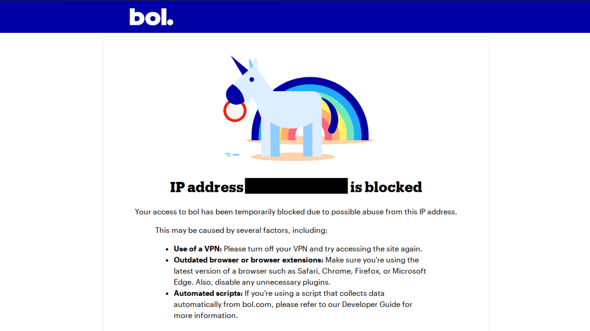

# Hier leg je kort uit wat de installatie- en run-instructies zijn.

...

## Additionele informatie

### CI/CD

Ik heb de pipeline opgezet, maar merkte dat mijn tests faalden omdat bol.com de requests blokkeerde. Ik weet niet hoe ik dit moet omzeilen en ook niet of het toegestaan zou zijn aangezien het om een productie-omgeving gaat. Ik ben hier daarom bewust terughoudend in geweest en dit onderdeel beperkt gehouden tot het opzetten van de pipeline.

